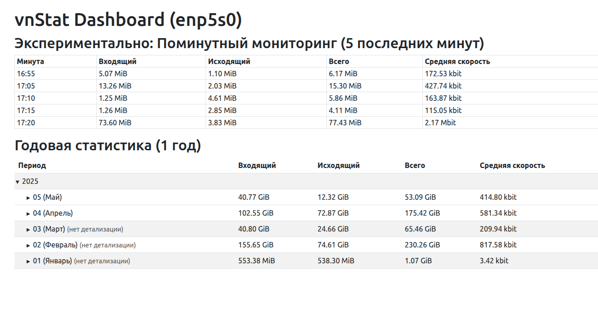

# vnStat Dashboard

A modern web interface for monitoring network traffic statistics using vnStat. This Flask-based dashboard provides an intuitive hierarchical view of your network usage data with expandable year/month/day/hour/5-minute breakdowns.



*Screenshot: Example interface showing yearly statistics with expandable categories*

## ✨ Features

- **Hierarchical Data View**: Browse traffic statistics by years → months → days → hours → 5-minute intervals
- **Interactive Interface**: Expandable tree structure with click-to-expand functionality
- **Real-time Data**: Dynamic updates from vnStat database
- **Responsive Design**: Modern Bootstrap-based UI that works on desktop and mobile
- **Configurable Display**: Customizable time ranges and data limits
- **Security Hardened**: Input validation and secure command execution
- **Performance Optimized**: Efficient parsing and minimal resource usage

## 📋 Requirements

### System Requirements
- **Operating System**: Linux (tested on Ubuntu, Debian, CentOS)
- **Python**: 3.6 or higher
- **vnStat**: 2.0+ (for network traffic monitoring)
- **Network Interface**: Active network interface to monitor

### Python Dependencies
- Flask 2.0.1+
- Werkzeug 2.0.1+
- Jinja2 3.0.1+
- MarkupSafe 2.0.1+

## 🚀 Quick Start

### 1. Install System Dependencies

**Ubuntu/Debian:**
```bash
sudo apt update
sudo apt install vnstat python3 python3-pip python3-venv
```

**CentOS/RHEL:**
```bash
sudo yum install vnstat python3 python3-pip
# or for newer versions:
sudo dnf install vnstat python3 python3-pip
```

### 2. Configure vnStat

Start vnStat service and let it collect data:
```bash
# Start vnStat daemon
sudo systemctl start vnstat
sudo systemctl enable vnstat

# Verify vnStat is working
vnstat -i eth0  # Replace eth0 with your interface name
```

**Find your network interface:**
```bash
ip link show  # List all network interfaces
```

### 3. Install vnStat Dashboard

```bash
# Clone the repository
git clone https://github.com/yourusername/vnstat-dashboard.git
cd vnstat-dashboard

# Create virtual environment (recommended)
python3 -m venv venv
source venv/bin/activate

# Install Python dependencies
pip install -r requirements.txt
```

### 4. Configuration

Copy and edit the configuration file:
```bash
cp config.py.example config.py
nano config.py  # Edit with your preferred editor
```

**Key configuration options:**
```python
# Network interface to monitor (REQUIRED)
VNSTAT_IFACE = "eth0"  # Change to your interface name

# Web server settings
WEB_HOST = "0.0.0.0"   # 0.0.0.0 for all interfaces, 127.0.0.1 for localhost only
WEB_PORT = 5000        # Port number
DEBUG = False          # Set to True only for development

# Display settings
TOP_MIN5_COUNT = 5     # Number of recent 5-minute intervals to show

# Logging
LOG_FILE = "vnstat_dashboard.log"
LOG_LEVEL = "INFO"     # DEBUG, INFO, WARNING, ERROR, CRITICAL
```

### 5. Run the Application

```bash
# Development mode
python dashboard.py

# Production mode (recommended)
python dashboard.py > /dev/null 2>&1 &
```

Visit `http://localhost:5000` in your web browser.

## 🐳 Docker Deployment

### Build and Run with Docker

```bash
# Build the Docker image
docker build -t vnstat-dashboard .

# Run the container
docker run -d \
  -p 5000:5000 \
  --net=host \
  -v $(pwd)/config.py:/app/config.py \
  -v /var/lib/vnstat:/var/lib/vnstat:ro \
  --name vnstat-dashboard \
  vnstat-dashboard
```

### Docker Compose (Recommended)

Create `docker-compose.yml`:
```yaml
version: '3.8'
services:
  vnstat-dashboard:
    build: .
    ports:
      - "5000:5000"
    volumes:
      - ./config.py:/app/config.py
      - /var/lib/vnstat:/var/lib/vnstat:ro
    restart: unless-stopped
    network_mode: host
```

Run with:
```bash
docker-compose up -d
```

## 📁 Project Structure

```
vnstat-dashboard/
├── dashboard.py           # Main Flask application
├── vnstat_parser.py      # vnStat output parser with security validations
├── config.py            # Configuration file (create from config.py.example)
├── config.py.example    # Example configuration
├── requirements.txt     # Python dependencies
├── templates/
│   └── dashboard.html   # Main dashboard template
├── docs/               # Documentation
│   ├── API.md         # API documentation
│   ├── SECURITY.md    # Security considerations
│   └── TROUBLESHOOTING.md
├── Dockerfile         # Docker configuration
└── README.md         # This file
```

## 🔧 Advanced Configuration

### Environment Variables

You can override configuration using environment variables:
```bash
export VNSTAT_IFACE="enp0s3"
export WEB_PORT="8080"
export DEBUG="False"
python dashboard.py
```

### Reverse Proxy Setup (Nginx)

```nginx
server {
    listen 80;
    server_name your-domain.com;
    
    location / {
        proxy_pass http://127.0.0.1:5000;
        proxy_set_header Host $host;
        proxy_set_header X-Real-IP $remote_addr;
        proxy_set_header X-Forwarded-For $proxy_add_x_forwarded_for;
        proxy_set_header X-Forwarded-Proto $scheme;
    }
}
```

### Systemd Service

Create `/etc/systemd/system/vnstat-dashboard.service`:
```ini
[Unit]
Description=vnStat Dashboard
After=network.target vnstat.service

[Service]
Type=simple
User=www-data
Group=www-data
WorkingDirectory=/opt/vnstat-dashboard
Environment=PATH=/opt/vnstat-dashboard/venv/bin
ExecStart=/opt/vnstat-dashboard/venv/bin/python dashboard.py
Restart=always
RestartSec=10

[Install]
WantedBy=multi-user.target
```

Enable and start:
```bash
sudo systemctl daemon-reload
sudo systemctl enable vnstat-dashboard
sudo systemctl start vnstat-dashboard
```

## 🔒 Security Considerations

This application includes several security enhancements:

- **Input Validation**: Network interface names are validated to prevent command injection
- **Command Execution**: Uses secure subprocess execution with timeouts
- **Error Handling**: Graceful error handling prevents information disclosure
- **Production Settings**: Debug mode disabled by default
- **Logging**: Configurable logging levels to prevent sensitive data exposure

For detailed security information, see [docs/SECURITY.md](docs/SECURITY.md).

## 🐛 Troubleshooting

### Common Issues

**1. "No module named 'flask'" error**
```bash
# Install in virtual environment
python3 -m venv venv
source venv/bin/activate
pip install -r requirements.txt
```

**2. "vnstat command not found"**
```bash
# Install vnStat
sudo apt install vnstat  # Ubuntu/Debian
sudo yum install vnstat   # CentOS/RHEL
```

**3. "No data available"**
```bash
# Check if vnStat is collecting data
vnstat -i eth0
sudo systemctl status vnstat
```

**4. Interface not found**
```bash
# List available interfaces
ip link show
# Update config.py with correct interface name
```

**5. Permission denied accessing vnStat database**
```bash
# Add user to vnstat group or run with appropriate permissions
sudo usermod -a -G vnstat $USER
```

For more troubleshooting information, see [docs/TROUBLESHOOTING.md](docs/TROUBLESHOOTING.md).

## 📊 API Documentation

The dashboard exposes several endpoints for programmatic access. See [docs/API.md](docs/API.md) for detailed API documentation.

## 🤝 Contributing

We welcome contributions! Please see our contributing guidelines:

1. Fork the repository
2. Create a feature branch (`git checkout -b feature/amazing-feature`)
3. Make your changes with proper documentation
4. Add tests if applicable
5. Commit your changes (`git commit -m 'Add amazing feature'`)
6. Push to the branch (`git push origin feature/amazing-feature`)
7. Open a Pull Request

### Development Setup

```bash
# Clone and setup
git clone https://github.com/yourusername/vnstat-dashboard.git
cd vnstat-dashboard

# Setup development environment
python3 -m venv dev-env
source dev-env/bin/activate
pip install -r requirements.txt
pip install -r requirements-dev.txt  # If available

# Run in development mode
export DEBUG=True
python dashboard.py
```

## 📝 Changelog

### Version 2.0.0 (Latest)
- **Security**: Added input validation and command injection protection
- **Performance**: Improved parsing efficiency and reduced memory usage
- **Reliability**: Enhanced error handling and graceful degradation
- **UI**: Better responsive design and user experience
- **Documentation**: Comprehensive documentation and setup guides

### Version 1.0.0
- Initial release with basic vnStat integration
- Hierarchical data display
- Bootstrap-based UI

## 📄 License

This project is licensed under the MIT License - see the [LICENSE](LICENSE) file for details.

## 🙏 Acknowledgments

- [vnStat](https://humdi.net/vnstat/) - The excellent network traffic monitor
- [Flask](https://flask.palletsprojects.com/) - The web framework
- [Bootstrap](https://getbootstrap.com/) - For the responsive UI components

## 📞 Support

- **Issues**: [GitHub Issues](https://github.com/yourusername/vnstat-dashboard/issues)
- **Discussions**: [GitHub Discussions](https://github.com/yourusername/vnstat-dashboard/discussions)
- **Documentation**: Check the `docs/` directory for detailed guides

---

**⭐ If you find this project useful, please consider giving it a star on GitHub!** 